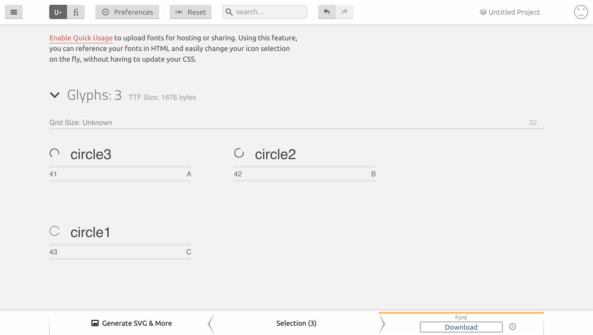

# Documentation

## Creating the custom TTF Font

The SVG files inside the "phoi-circles" folder are converted in TTF through icomoon.io free service.

You can find more info in the **fonts**/**icomoon** folder.

## Creating the circles

The SVG files sources are inside phoi-circles (EPS & SVG format).

 